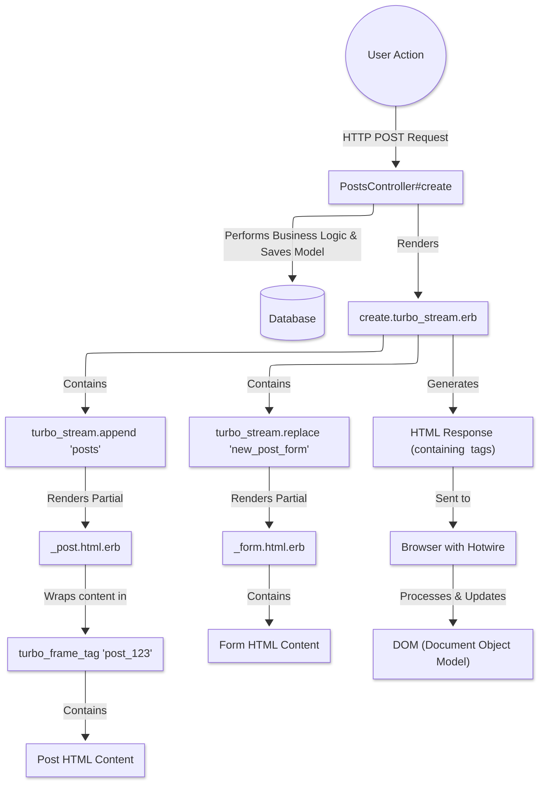

# ActionController and Turbo Division

> **WHL**: I got a question to ask. Looking at my Rails controllers, they looks too simple since most of the view logic is coded in *.turbo_stream.erb. Do you think it's to scattered?

**ChatGPT**: No, that’s not “too scattered” – that’s actually very close to what a good Turbo/Rails structure looks like. The trick is to be deliberate about **what kind of logic** goes where.

**Gemini**: It is not necessarily "too scattered," but it does signal a shift in where the "application glue" lives. ==In the Turbo paradigm, the controller ideally returns to being a pure HTTP traffic director—receiving the request, commanding the model, and essentially saying "Done." The `*.turbo_stream.erb` file then handles the *consequences* of that action on the UI. This separation is elegant if you strictly view the `turbo_stream.erb` files as *declarative UI updates*== (e.g., "append this created item to the list" or "replace the form with errors"). It becomes "scattered" and messy only if you start leaking **business logic** or complex **control flow** into those ERB files.

## What controllers are supposed to look like?

In classic Rails:

- Models: business rules, persistence
- Controllers: coordinate a request -> call the model -> decide format -> pick a view
- Views: presentation

With Turbo:

- Controllers become **even more orchestration-only**:
	- load record(s)
	- run domain operation (create/update/destroy)
	- set instance variables
	- `respond_to` block, nothing more

So a controller like:

```ruby
def update
    @product.update(product_params)

    respond_to do |format|
        format.html
        format.turbo_stream
    end
end
```

==is not “too simple”. That’s **exactly** what you want.==

If you start feeling the urge to put `if turbo_frame_request?` and a lot of branching inside the controller, that is often a smell.

Your earlier realisation was spot on: “The UI logic (which frames to update) lives in the `*.turbo_stream.erb` file, not in the controller.” That’s not a hack. That’s a clean separation.

## What `*.turbo_stream.erb` is really doing?

==A `.turbo_stream.erb` is basically a **wiring diagram**==. This is **view logic**, but it is not business logic. Each `turbo_stream.erb` file answers:

- “Given the result of the action, how should the UI react?”
- “When this action runs (success/failure), which frames should be updated, and with which partials?”
- “When this action succeeds, update these frames with these partials.”
- “When there is an error, replace this form, and maybe also update an error banner.”

```erb
<%= turbo_stream.update "products-table-frame" do %>
	<%= render "products/table", products: @products %>
<% end %>
<%= turbo_stream.update "side-body-frame" do %>
	<%= render "products/form", product: @product %>
<% end %>
```

So, in your mental model:

- ==Controller = “What happened in the domain?”==
- `.turbo_stream.erb` = “Given what happened, how should the browser change?”
- Partials (_form, _row, _table, etc.) = “What is the actual UI structure and markup?”

That is three clear layers, not random scattering.

## When does it become “too scattered”?

### The "Smell" Test

You can determine if it is too scattered by looking at what lives inside the `*.turbo_stream.erb` file.

- **Good Order:** ==The file contains only Turbo Frame tags or Stream actions (`turbo_stream.replace`, `turbo_stream.append`) rendering partials.== This maintains "being-in-order" because the file strictly concerns itself with *how* the page mutates, not *why*.
- **Bad Scatter:** The file contains Ruby `if/else` statements determining *which* stream to render based on model state. This logic belongs in the controller or the model. If you find yourself checking `@post.published?` inside the stream file to decide whether to append it to a list or show a flash message, you have scattered your domain logic into the view layer.

### It only becomes messy when:

1. **One action has many possible UI outcomes** and you encode all of them in a single giant `.turbo_stream.erb` full of conditionals:

```erb
<% if @product.errors.any? %>
...
<% elsif params[:from] == "side" %>
...
<% elsif params[:from] == "inline" %>
...
<% else %>
...
<% end %>
```

2. The same DOM ids and partials are referenced from many different places with no pattern:

- `products-table-frame` updated from 4 different `.turbo_stream.erb` files.
- Different actions doing slightly different variants of the same update.

3. Complex logic is embedded directly in view templates:

- heavy conditionals
- complex Ruby loops
- business rules in view land.

If you are not doing this, you are probably fine.

## Simple rules to keep things cohesive

You can use these rules. They work very well for Turbo-style apps:

### Rule 1: ==Controllers only decide “success vs failure” and “format”.==

For each action: No DOM ids in controllers. ==No render turbo_stream: inline. You keep the “wiring” outside.==

```ruby
def create
        @product = Product.new(product_params)

        if @product.save
                respond_to do |format|
                        format.html   # redirect_to ...
                        format.turbo_stream # create.turbo_stream.erb
                end
        else
                respond_to do |format|
                        format.html   # render :new, status: :unprocessable_entity
                        format.turbo_stream # create.turbo_stream.erb (same file, but error path)
                end
        end
end
```


### Rule 2: ==1 action → 1 `*.turbo_stream.erb` file==

Use Rails convention:

- create → create.turbo_stream.erb
- update → update.turbo_stream.erb
- destroy → destroy.turbo_stream.erb
- index → index.turbo_stream.erb if needed

Inside each file:

- handle success and failure branches
- always update the same set of frames for that action (even if content differs)

That gives you a **predictable map**:

- “I want to know what happens when a product is updated” → open products/update.turbo_stream.erb.

==Not scattered; just distributed by action.==

### Rule 3: ==Partials are the “building blocks”, streams are the “wiring”.==

- _table.html.erb – table structure
- _row.html.erb – one row
- _form.html.erb – form
- _side_panel.html.erb – side body structure, if you have one

Your *.turbo_stream.erb should mostly be:

```erb
<%= turbo_stream.update "products-table-frame" do %>
        <%= render "products/table", products: @products %>
<% end %>
<%= turbo_stream.update "side-body-frame" do %>
        <%= render "products/side_panel", product: @product %>
<% end %>
```

i.e. **no complex HTML here**, just selecting which partial goes to which frame.

### Rule 4: Extract real logic into helpers / view objects.

When you see things like this in a view:

```erb
<% if product.role == "FINISHED" && product.valid_since <= Date.today && product.formulas.any? %>
	...
<% end %>
```

Move that to:

```ruby
# app/helpers/products_helper.rb
def product_ready_for_production?(product)
    product.role == "FINISHED" && product.valid_since <= Date.current && product.formulas.any?
end
```

and use:

```erb
<% if product_ready_for_production?(product) %>
	...
<% end %>
```

Or, for really complex behaviour, create a presenter / decorator.

This keeps the structure:

- `.turbo_stream.erb` → wiring
- ==helpers / presenters → logic==
- partials → markup

## 5. A mental checklist for you

When you look at your code, ask yourself:

1. **Controllers**

	- Does this controller know about DOM ids?

		If yes, try to move that to a `.turbo_stream.erb`.

	- Does it branch UI behaviour (`if turbo_frame_request?`)?

		If yes, can that be expressed by just using `respond_to` and proper templates?

	

2. **turbo_stream views**

	- Does each action have its own turbo_stream file?
	- Is each file short enough that you can see all updates at a glance without scrolling too much?
	- Are you mostly calling render "partial" inside each stream?

	

3. **Partials**

	- Is there a single canonical `_table`, `_row`, `_form` for that resource?
	- If you need variants, are they clearly named (`_row_compact`, `_row_with_details`)?

	

If most answers are “yes”, you are not scattered; you are well structured.

## My honest take on your situation

From what you described and from our previous conversations:

- ==Your controllers becoming “simple” is **a sign of improvement**, not a problem.==
- Moving “which frames to update and with what partials” into `*.turbo_stream.erb` is **exactly** the pattern that fits your BOS shell idea: shell as a canvas, streams as wiring.
- ==The only thing you need to watch is **too much branching inside a single turbo_stream file**. When that happens, split responsibilities, or push logic into helpers.==




